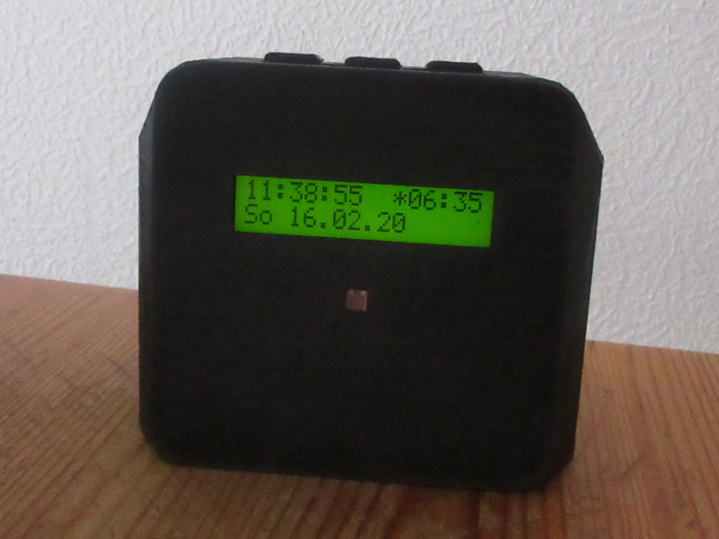
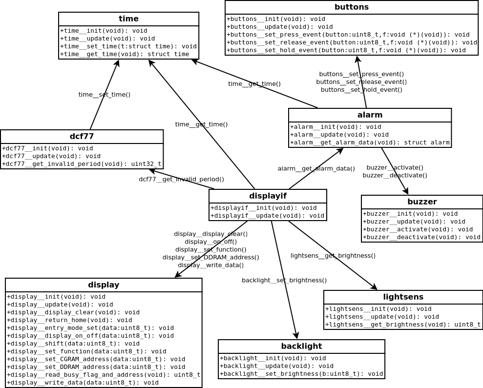
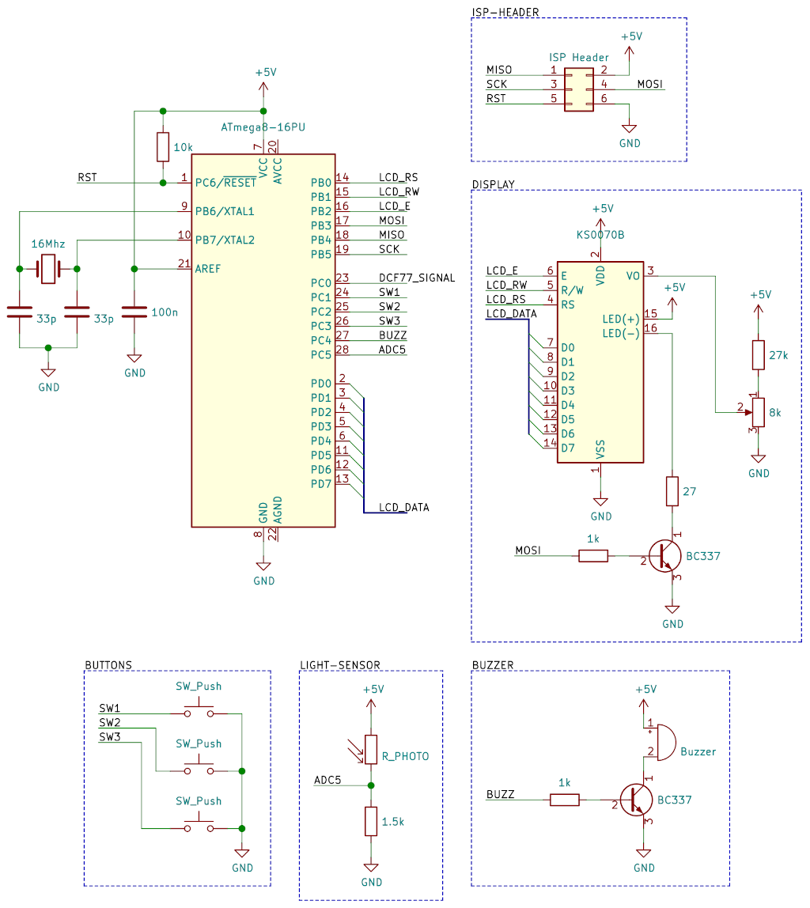

# alarm clock
Code and schematic for an alarm clock with DCF77 time source

## Features
* receives information from the DCF77 time signal
* automatic adjustment of backlight brightness

## Call graph

## Schematic

